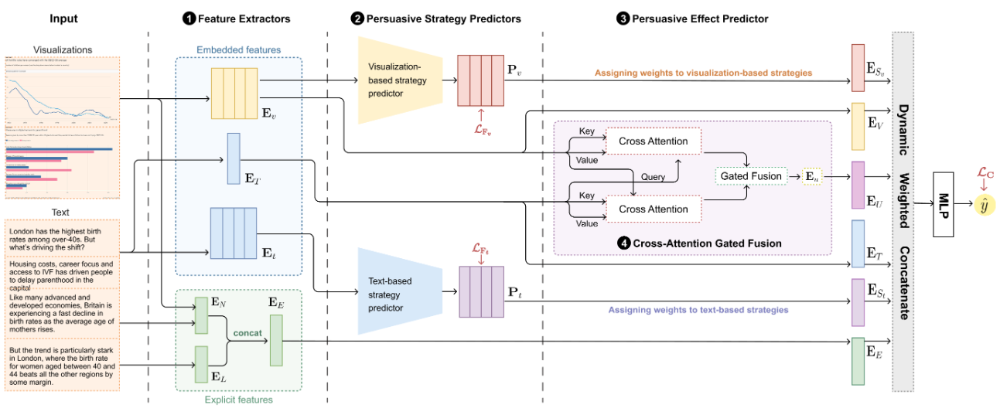

Data-driven news articles combine narrative storytelling with data visualizations to inform and influence public opinion on pressing societal issues. These articles often employ persuasive strategies, which are rhetorical techniques in narrative framing, visual rhetoric, or data presentation, to influence audience interpretation and opinion formation. While previous research has examined whether and when data visualizations persuade, the strategic choices made by persuaders remain largely unexplored. Addressing this gap, our work presents a taxonomy of persuasive strategies grounded in psychological theories and expert insights, categorizing 15 strategies across five dimensions: Credibility, Guided Interpretation, Reference-based Framing, Emotional Appeal, and Participation Invitation. To facilitate large-scale analysis, we curated a dataset of 936 data-driven news articles annotated with both persuasive strategies and their perceived effects. Leveraging this corpus, we developed a multimodal, multi-task learning model that jointly predicts the presence of persuasive strategies and their persuasive effects by incorporating both embedded (text and visualization) and explicit (visual narrative and psycholinguistic) features. Our evaluation demonstrates that our model outperforms state-of-the-art baselines in identifying persuasive strategies and measuring their effects.

